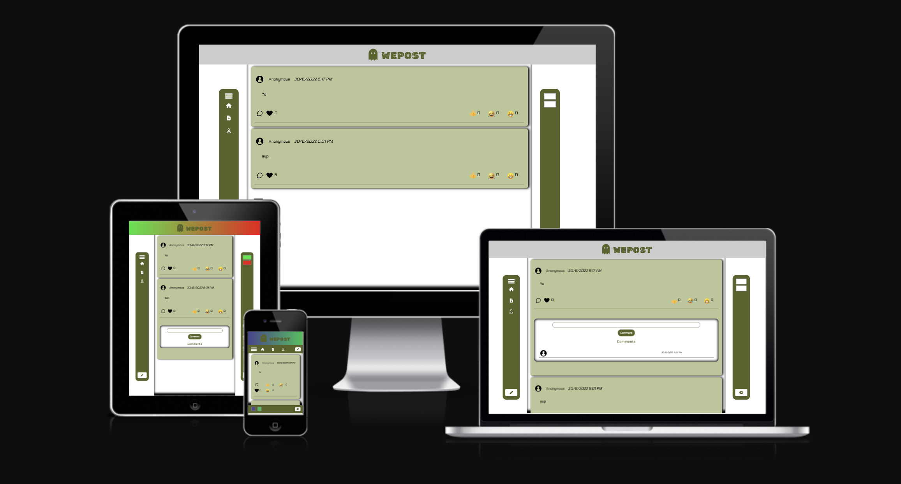
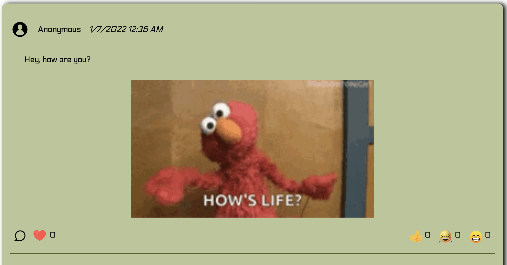
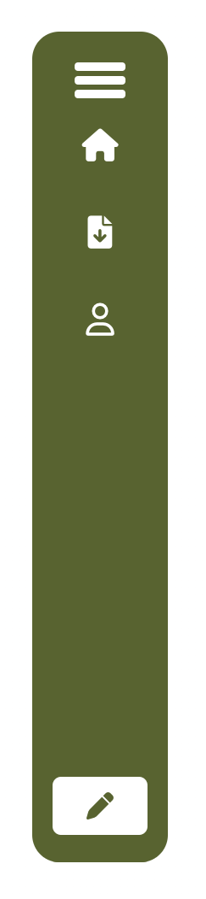
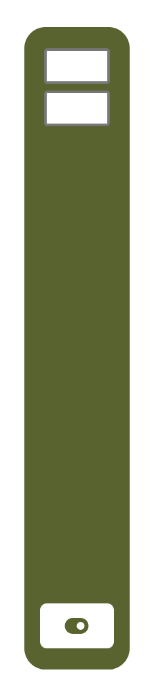
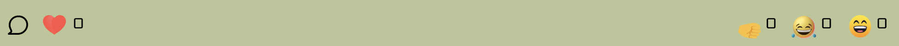
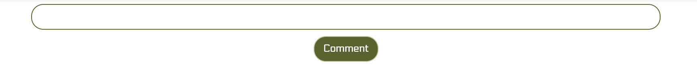
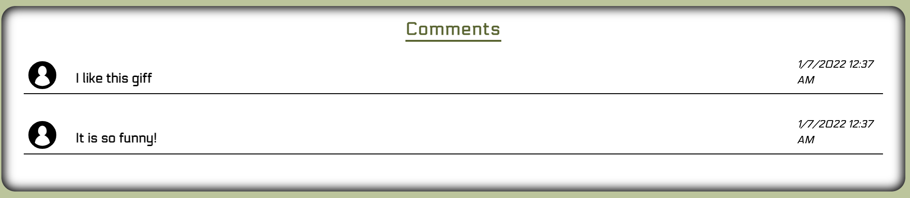

# WePost Server

To access the live version of the website please use this following link: https://we-post.netlify.app/?

# Project Description

Welcome to WePost, a community journaling webapp. WePost allows users to speak about whatever is on their minds through posts. No information about the poster is shared so you can make posts anonymously without any worries!

# Features

### Header

- The header displays the logo of the site in green and a light grey background.
- The color scheme for the site was chosen for best color contrast to imporve accessibility.

### Posts 

- Posts are displayed as a list in ascending order, where the newer posts are put at the top.
- The posts all have liking and reactions buttons that allow users to quickly share their feelings towards a post.
- The comment button allows the user to comment on a post if the user also has something to share about the post. 

### Postbar 
 

- The Postbar allows the user to click a button and make a post.
- When the button is pressed the user will be presented with a modal form to fill out.
- Within the form, the user can add a post description, and the option to add a giff.

### Colorbar

- The color bar allows the user to personalise the site. By picking colors for the color inputs, the header color changes and becomes more personalised.

### Reactions & Likes

- The reactions and likes are displayed as emojis, which the user can click. 
- When clicked, a counter increments to show the number of each reaction/like associated with the post.

### Comment Bar

- The comment bar is displayed as a text input below the post.
- Then when the user has a comment to make, they are able to click the comment button and a comment will be assigned to the post.

### Comments

- The comments are displayed in the comment container. Here a list of comments associated to each individual post is displayed.
- The comments are also listed in ascending order with newest at the top.

# Implementation

## Installation & Usage

- Git clone/download this repository
- Open repository using GitBash or GitDesktop
- Open repository in Visual Studio Code

### Server

- Right click on the server folder and choose `Open in Integrated Terminal`
- Run command `npm install` to download and install all node dependencies
- Run command `npm start` to start live server

### Client

- Must git clone/download the client repository from: https://github.com/Ismael76/WePost-Client
- Navigate into the client folder and open index.html via live server extension on VSCode or you may use the live server URL

# Technologies

- GitHub
- GitBash (or GitDesktop, or any Terminal)
- Visual Studio Code
- CSS
- HTML
- JavaScript
- Giphy API
- NodeJS

## Process

The Project kicked off with a meeting to run through the purpose of the project and discuss potential solutions and ideas. The meeting was also carried out to ensure the team's focus and understanding of the requirements and needed deliverables.

Moving on, tasks were divided in two main areas, server side and client side. Tasks were allocated to each member of the team based on individual strengths and weaknesses. We had used GitHubs Kanban board to keep track of assigned tasks.

Throughout the development stages of the project several meetings took place over Slack to ensure everyone was meeting the targets and assistance was provided in any areas each member was unsure about. This approach proved to be of great benefit for performance and efficiency as we were able to stay on track and implement alot of the requirements on time. Additionaly, it helped keeping the team stay focused and motivated.

## Future Work

- Account creation, allowing users to create an account to keep track of their posts.
- Implementing more CRUD functionality such as allowing users to edit and delete their posts.

## Wins & Challenges

### Wins

- Implemented the PATCH request for reactions and likes.
- Worked well as a team with assignment of tasks evenly. 
- Very organised work structure.

### Challenges

- Testing for client-side was difficult to implement.
- Planning more at the beginning.

# Licence

[MIT licence](https://opensource.org/licenses/mit-license.php)

